# SCORM 1.2 - Responsive Learning Management System (LMS)

Responsive LMS with SCORM 1.2 RTE

This is SCORM 1.2 compliance - all the mandatory and optional fields are implemented.

This LMS however doesn't make use of all of the SCO field as to keep the LMS simple.

Be aware the SCORM 1.2 documentation is vague in places so I coded it to what I thought was best. There are non-documented errors in my version of SCORM 1.2 RTE due to the documentation lacking any guidance on how to deal with illegal values / ranges. Refer to the LMSSCORM12RTE.js for these additional error code.

This LMS doesn't make any use of any 3rd party framework.
<br/><br/>

# SCORM 2004

At this time, this SCORM 1.2 Run Time Engine (RTE) is not SCORM 2004 compatible. I believe it is missing a few fields in the Sharable Content Object (SCO). I've never actually seen the SCORM 2004 documentation so I have no idea what else is involved in getting this to work with this LMS. I've no plans in getting this to work for SCORM 2004 unless someone wants to commission me to write this. See Consulting and Customisation at the bottom of this document if you want me to implement SCORM 2004.
<br/><br/>

# Installation
 
Steps to install the LMS
 
   * Clone / Download this repository
   * Create a database called LMS
   * Import LMS.sql into the LMS database
   * Open up **cLib/cDatabase.php** and configure the following lines according to your database settings:
             
         $_cDB_PASS = "password";
         $_cDB_USER = 'root';
         $_cDB_NAME = 'LMS';
         $_cDB_HOST = 'localhost:3306';

 
 Once you have followed the above steps you can run the application. However there are additional steps that are required to get course upload working.

1) For PHP to unzip you need to have unzip extension installed. See the following link for further details:<br>
https://stackoverflow.com/questions/41274829/php-error-the-zip-extension-and-unzip-command-are-both-missing-skipping

2) In order for PHP to create directories for new courses and delete files, e.t.c. you need change the **/course** directory owner to **www-data** - See the link below the part where it says 3 step solution<br>
https://stackoverflow.com/questions/2900690/how-do-i-give-php-write-access-to-a-directory 
<br/><br/>
# Usage
 
### Login using one of the follow preset account

 | Username      | Password      | Role          |
 | ------------- | ------------- | ------------- |
 | super         | password      | Super admin   |
 | admin         | password      | Admin         |
 | student          | password      | Student       |
<br/><br/>
### Different login roles have the following accessibility

  
 |                 | Student       | Admin         | Super Admin   |
 | --------------  |:-------------:|:-------------:|:-------------:|
 | Launch course   | &check;         | &check;           | &check;           |
 | Add users       |              | &check;           | &check;           |
 | View users      |              | &check;           | &check;           |
 | View modules    |              | &check;           | &check;           |
 | Change password |              | &check;           | &check;           |
 | Change password |              | &check;           | &check;           |
 | Configure LMS   |              |              | &check;           |
 | Upload Courses   |              |              | &check;           |
 | Debugging and Logging tools     |              |              | &check;              |
 
<br/>
# Password salt
The passwords are salted for additional security. You need to change this value because the salt value should be a secret. Given that you've got this source code from github everyone knows your current secret salt password. In order to change this open up **\clib\cLib_Users.php** and search for SALT. 

    const   SALT = "9X643fAy25w83b8fxfde3!£98X76232";

Change the salt string to a similar complex string of mixed characters - Be as complex as you like as you do not need to remember this.

You should only change the SALT value once and before you start adding new user into the system. You cannot change the SALT after you have added new users to the system as their password won't work.
<br/><br/>
**<span style="color:red">Password Warning</span>**

The above default passwords are weak and should be changed as soon as possible. **Before you do this, please read up Password salt below**.

Login as each admin or super admin and change the password via the admin menu. For students, you can edit their password via the Add / Edit User menu option and click on their name.
<br/><br/>
# Screenshot and files

The Template (.TPL) files are HTML that are rendered for each page and are stored in cView directory. The name of each TPL file are listed below each Screen dump. The PHP files are stored in cModel directory and Javascript files are stored in the js directory.

## Login screen  <span style="float:right;font-size:12px;color:blue;line-height:32px;vertical-align:top">/<span>
 
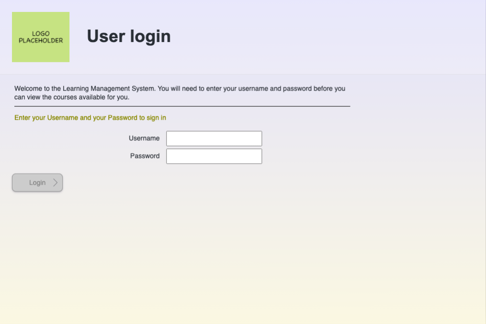
 
 | Type          | path / file   |
 | ------------- | ------------- |
 | Template      | cViews/userLoginScreen.tpl      |
 | JavaScript    |js/loginLMSUserLogin.js|
 | PHP           |cModel/cUserLogin.php|            
<br/>
## Training Hub <span style="float:right;font-size:12px;color:blue;line-height:32px;vertical-align:top">/admin/traininghub<span>
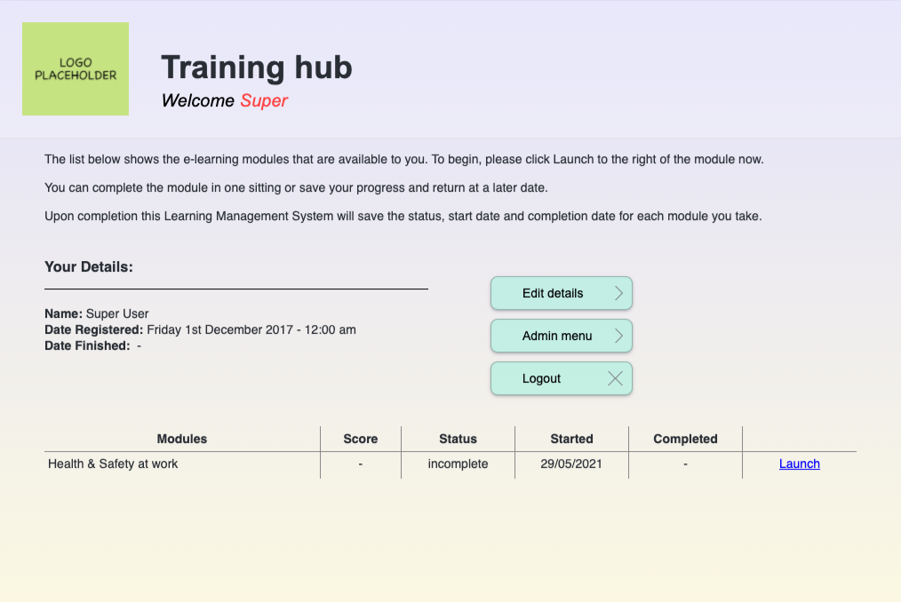
 | Type          | path / file   |
 | ------------- | ------------- |
 | Template      | cViews/trainingHub.tpl      |
 | JavaScript    | js/LMSScorm12RTE.js<br>js/LMSScormDebug.js      |
 | PHP           | cModel/cTrainingHub.php      |
<br/><br/>
## Edit your details <span style="float:right;font-size:12px;color:blue;line-height:32px;vertical-align:top">/traininghub/edit-user-details<span>
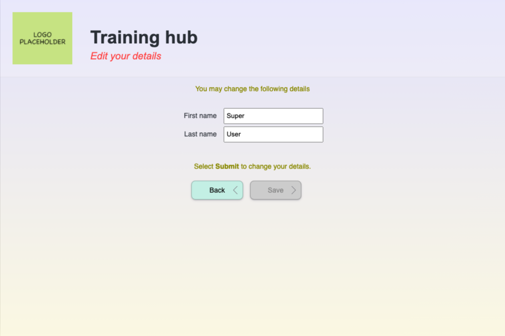
 | Type          | path / file                        |
 | ------------- | ---------------------------------- |
 | Template      | cViews/trainingHubEditDetails.tpl  |
 | Extension     | cLib/cLib_cPasswordManager.php         |
 | JavaScript    | js/LMSEditUserDetails.js           |
 | PHP           | cModel/cTrainingHubEditDetails.php |
<br/><br/>
## Main Menu <span style="float:right;font-size:12px;color:blue;line-height:32px;vertical-align:top">/admin<span>
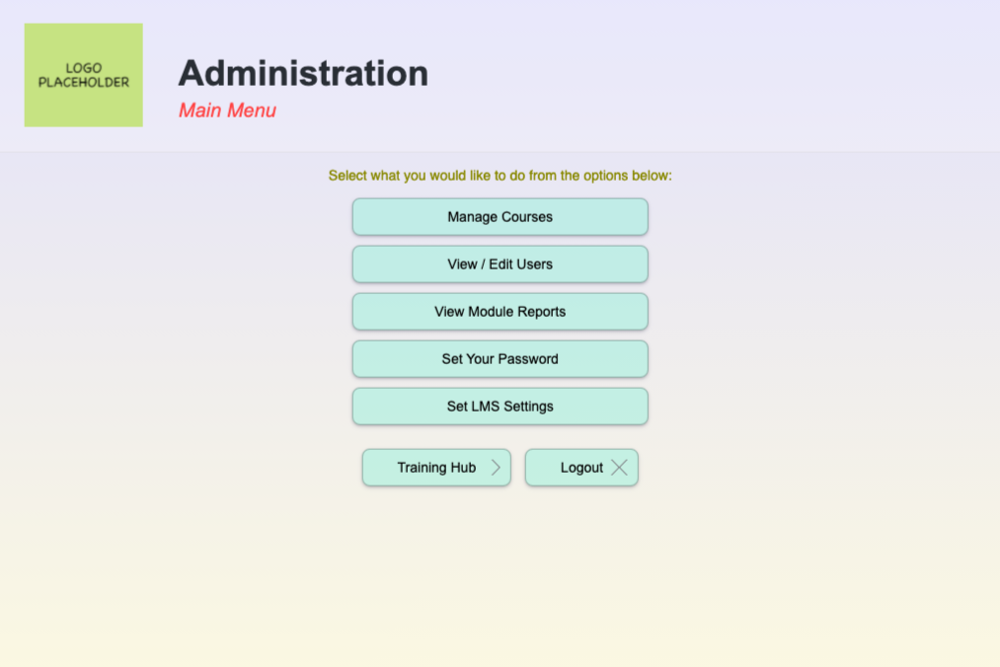
 | Type          | path / file              |
 | ------------- | ------------------------ |
 | Template      | cViews/adminMainMenu.tpl |
 | PHP           | cModel/cAdminMainMenu.php|
<br/><br/>
## Manage Courses <span style="float:right;font-size:12px;color:blue;line-height:32px;vertical-align:top">/admin/upload-courses<span>
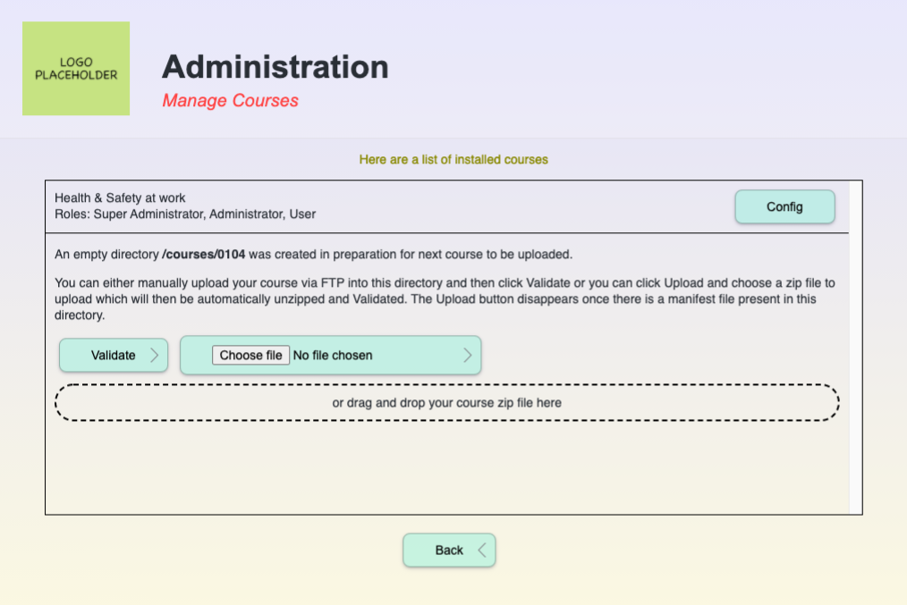
 
 | Type          | path / file   |
 | ------------- | ------------- |
 | Template      | cViews/cAdminUploadCourses.php      |
 | JavaScript    | js/adminLMSUploadCourse.js      |
 | PHP           | cModel/adminUploadCourses.tpl      |
<br/><br/>
## Edit Course Settings <span style="float:right;font-size:12px;color:blue;line-height:32px;vertical-align:top">/admin/edit-course/id/XXXX<span>
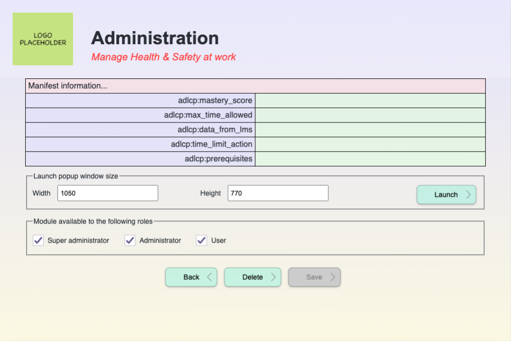
 | Type          | path / file   |
 | ------------- | ------------- |
 | Template      | cViews/adminEditCourse.tpl      |
 | Extension     | cLib/cLib_cCourseSupport.php            |
 | JavaScript<br><br><br>| js/adminLMSEditCourseDetails.js<br>js/LMSScorm12RTE.js<br>js/LMSScormDebug.js|
 | PHP           | cModel/cAdminEditCourse.php      |
<br/><br/>
## View Users <span style="float:right;font-size:12px;color:blue;line-height:32px;vertical-align:top">/admin/view-users/page/1/order/name/in/asc<span>
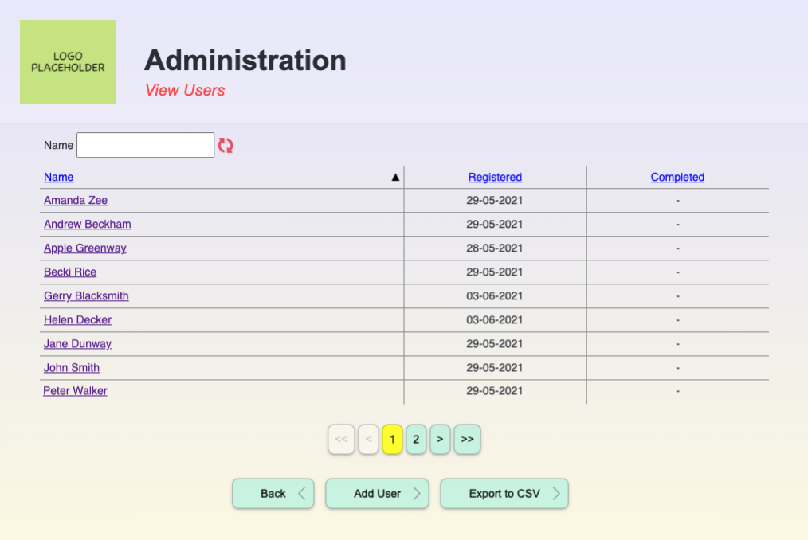
 | Type          | path / file   |
 | ------------- | ------------- |
 | Template      | cViews/adminViewUsers.tpl      |
 | JavaScript    | js/adminLMSModuleReports.js|
 | PHP           | cModel/cAdminViewUsers.php      |
<br/><br/>
## Edit User Record <span style="float:right;font-size:12px;color:blue;line-height:32px;vertical-align:top">/admin/edit-user/page/1/order/name/in/asc/id/XXXX<span>
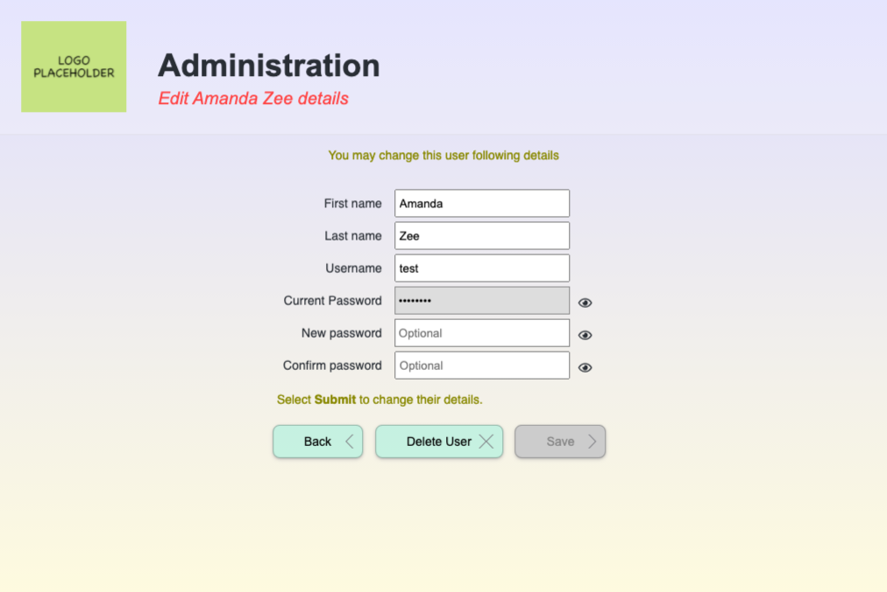
 
 | Type          | path / file   |
 | ------------- | ------------- |
 | Template      | cViews/adminEditAnotherUserDetails.tpl |
  | Extension     | cLib/cLib_cPasswordManager.php |
 | JavaScript    | js/LMSEditUserDetails.js |
 | PHP<br/><br/>| cModel/adminEditAnotherUserDetails.tpl<br/>cModel/adminDeletedUserDetails.tpl |
<br/><br/>
## View Module Reports <span style="float:right;font-size:12px;color:blue;line-height:32px;vertical-align:top">/admin/view-module-reports/page/1/order/name/in/asc<span>
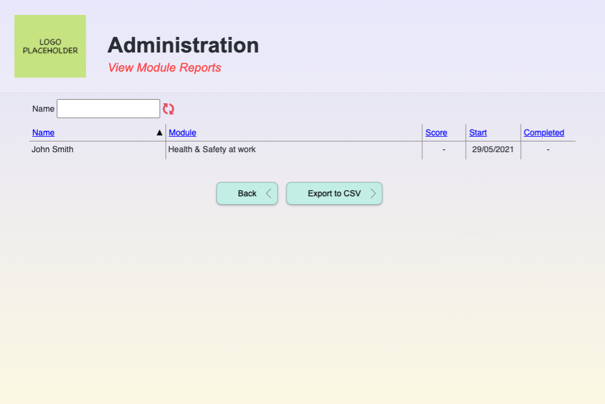
 
 | Type          | path / file   |
 | ------------- | ------------- |
 | Template      | cViews/adminViewModuleReports.tpl  |
 | JavaScript    | js/adminLMSModuleReports.js        |
 | PHP           | cModel/cAdminViewModuleReports.php |
<br/><br/>
## Edit Password <span style="float:right;font-size:12px;color:blue;line-height:32px;vertical-align:top">/admin/view-module-reports/page/1/order/name/in/asc<span>
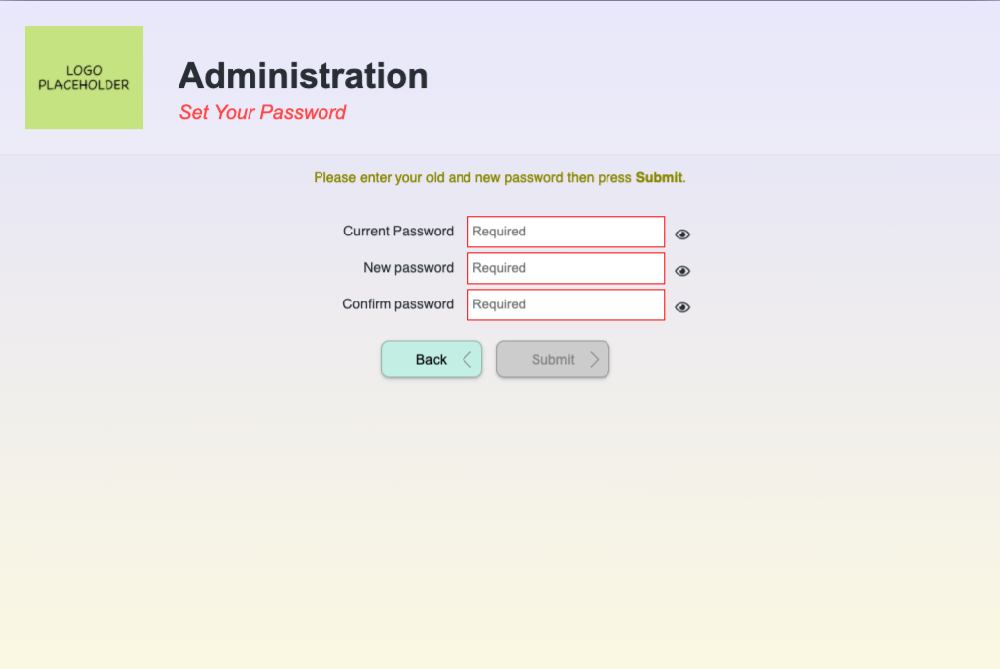
 
 | Type          | path / file   |
 | ------------- | ------------- |
 | Template      | cViews/adminSetAdminPassword.tpl      |
 | Extension     | cLib/cLib_cPasswordManager            |
 | JavaScript    | js/LMSEditUserDetails.js      |
 | PHP           | cModel/cAdminSetAdminPassword.php      |
<br/><br/>
## Set LMS Settings <span style="float:right;font-size:12px;color:blue;line-height:32px;vertical-align:top">/admin/settings<span>
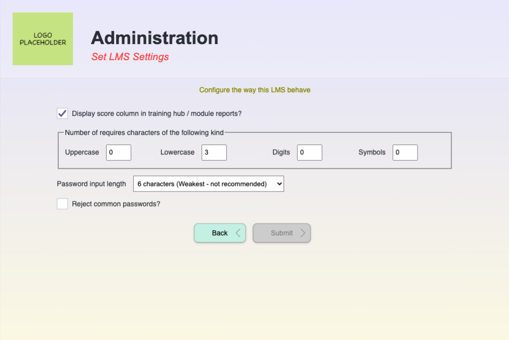
 
 | Type          | path / file   |
 | ------------- | ------------- |
 | Template      | cViews/adminSettings.tpl      |
 | Javascript    | js/adminLMSSettings.js      |
 | PHP           | cModel/cAdminSetSettings.php      |
<br/><br/>
# Debugging Tools

The debugging tools appear when you launch a course while logged in as the Super Administrator.

## Command Line
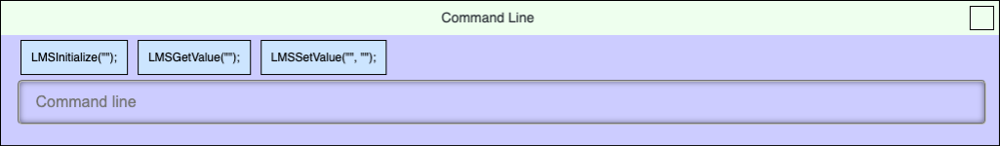

Clicking on LMSGetValue(""); button will automatically paste the text in the command line in order to save you time typing it out.

If you enter `LMSGetValue("cmi.core.student_name");` and press enter you will get the student name appearing in the log window.
<br/><br/>
## LMS Event Log

Every LMSXXXXX() calls that your courseware execute will be displayed by the Event Log window. This allows you to trace what is LMSXXXXX() calls are being made and when as you run through your course. This allows you to quickly spot any errors reported by the Event Log.

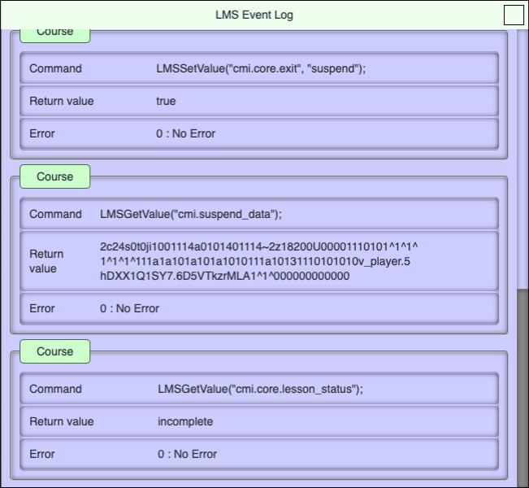

If you enter `LMSSetValue("cmi.core.student_name", "Hello World");` you will get an error appearing in the Log Window because cmi.core.student_name is a read only field. 
<br/><br/>
## CMI Data Object Viewer

The CMI Data Object Object Viewer allows you to inspect all the values held by the SCO in real time. You can see all the properties, their value, whether it is Read Only, Write Only or Read/Write and the type of value it accepts.

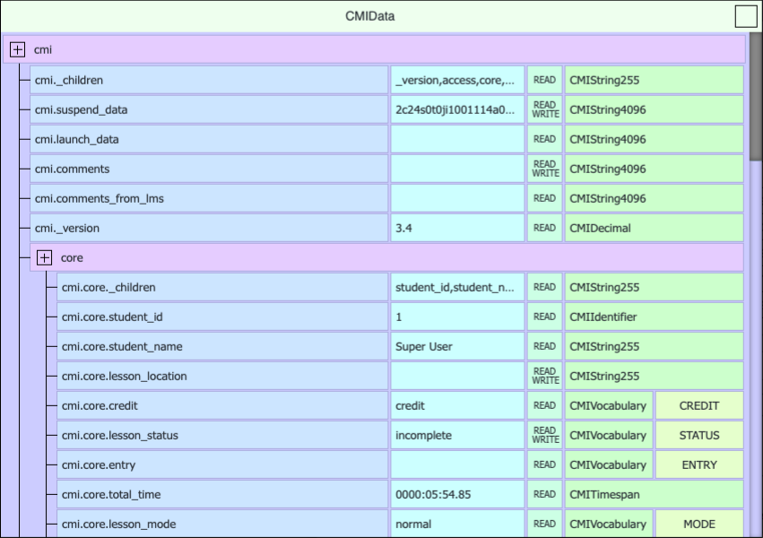

If you enter the following in the Command Line Window and press enter

```LMSSetValue("cmi.core.lesson_location", "Module 5 - Section 3");```

you'll see `cmi.core.lesson_location` value change in the CMI Data Object Viewer and you will also see Success message in the LMS Event Log Window. That means that command is safe and legal to put in your courseware and you will know such command isn't going to cause you an issue when you eventually run it through an LMS.
<br/><br/>
## Resetting SCO Data Object
There will be times when you want to start afresh without having to create new users with clean data. To do this login as Super Admin. Launch the course you want to reset the data for and then enter `reset` in the command line prompt. This will close down the current course and delete the existing SCO data. When you next launch the course you will begin as if this was your first attempt at running the course.

# Limitations
## Scorm 1.2 Run Time Engine (RTE)

This has been implemented 99.98%. There is a single @toDo and should someone request this feature I'll add it to RTE to make it 99.99%.

The remaining 0.01% is down to the documentation being quite vauge in parts and incomplete with a couple of missing items. So what I have coded may not match another RTE due to the fact another developer have interpreted what they mean differently to what I think.
<br/><br/>
## LMS

This LMS is rather basic and this is down to keeping the LMS rather simple as to fit everyone needs. While the SCORM 1.2 RTE allows you to store data to cmi.interactions, this LMS doesn't display the result of such data in the admin section. For some, this lack of feature may mean this LMS isn't suitable for your needs. You can always commission me to implement the cmi.interactions for the admin section of the LMS. You will find the CMI Data viewer to be very useful for debugging your course even if you find the LMS itself not useful for your need.
<br/><br/>
## Manifest Files

This LMS understand single and multiple SCO from a single manifest file. I tried about 20 sample courses that I have found online as well as several courses produced by some of my clients who have used this LMS and they were all recognised being as valid and worked as intended. However, these sample courses weren't really exploiting the full potential of what manifest files are capable of and as such I didn't really have something that was out-of-the-ordinary to work with. So there could well be cases where manifest file fails when using this LMS. So, check your existing courses before spending too much time customizing and extending this LMS.
<br/><br/>
## Items that are not fully implemented

There are a couple of things that partly coded up but is not complete as in not working. These are as followed:

  1. In the LMS setting page. The Reject common passwords? option is not working. It just need to query the commonPassword table when changing password or when you add new users.

  2. CSRF Tokens - There are a few commented out code but it is probably near 90% complete but definately doesn't work.

<br/><br/>
# FAQ

  * **Why does the debugging windows appear when I run the course?**
     The debugging window only appears if you are signed in as Super Administrator which probably the sign in you often use and so it appears as if it something that should not occur. Signing in using the Administrator or Student account will never see these debugging tools. This tool is meant to help you to track down bugs in your course. If you are finding this is annoying even for Super Administrator, you can always delete LMSScormDebug.js to remove the debugging feature. If this file doesn't exist, it still runs without issue.
  
  * **Why is the course window too big / small when I launch the course?**

    The course default size is 800 x 600. To change this setting do the following:
    1. Log in as Super Admin 
    2. Click Admin Menu from the Training Hub screen
    3. Click Manage Courses
    4. Each course has a Config button next to it, click Config next to the course you want to change size for.
    5. On this page, there is a width and hight property input field.
    6. Change the value, click launch to test it out. Once you've got the right width / height, click Save to save the settings.

    NOTE: Be aware, the window size on the Mac and PC includes the title bar. As such you probably need to test the course on both platform and tweak the window size slighly bigger as to work well with both OS.
 
  * **Why is the course is not appearing for the student?**

    When you upload the course, it will not be available for the user until you are ready to officially launch it. This is so that you can test your courseware during the development. Once you are happy with the course you then allow everyone to access to that course. To do this:
    1. Log in as Super Admin 
    2. Click Admin Menu from the Training Hub screen
    3. Click Manage Courses
    4. Each course has a Config button next to it, click that
    5. On this page, there is a section that says... Module available to the following roles. Click the user checkbox to allow users to access this training.

  * **How do I delete a user?**
    1. Login as Admin or Super Admin
    2. Click Admin Menu from the Training Hub screen
    3. Click View Edit User
    4. Click on the person name that you want to delete
    5. Click on the Delete User button

  * **How do I add a user?**
    1. Login as Admin or Super Admin
    2. Click Admin Menu from the Training Hub screen
    3. Click View Edit User
    4. Click the Add User button and then follow on screen instructions

  * **How do replace an existing course without losing current user records?**

    The short answer is you can't and that is due to the limitation to SCORM standard rather than my lack of implementation with this LMS. However that does not mean it is impossible using this LMS given that you can simply copy the new files over the old version and hope for the best. That method is not guarrenteed to work and can be unpredictable and in some cases cause random crashes. The outcome all depends on what the new version changes where. If you add/delete new pages or questions / change a question type / change the format of the book mark data e.t.c. then copying over old files will not end well. However, if you have just fixed spelling mistakes or replaced audio / video / images and leave the existing course structure intact then you should not encounter any problems. 
<br/><br/>

# Supporting Documentation
[Technical details of SCORM RTE 1.2](http://xml.coverpages.org/SCORM-12-RunTimeEnv.pdf)

[SCORM Standards and Documentation](https://adlnet.gov/projects/scorm/)
<br/><br/>
# Version History

* Version 1.0, 12th June 2021 - Initial Release
<br/><br/>
# MIT License

Copyright 2017-2021 John Leather - www.sphericalgames.co.uk

Permission is hereby granted, free of charge, to any person obtaining a copy of this software and associated documentation files (the "Software"), to deal in the Software without restriction, including without limitation the rights to use, copy, modify, merge, publish, distribute, sublicense, and/or sell copies of the Software, and to permit persons to whom the Software is furnished to do so, subject to the following conditions:

The above copyright notice and this permission notice shall be included in all copies or substantial portions of the Software.

THE SOFTWARE IS PROVIDED "AS IS", WITHOUT WARRANTY OF ANY KIND, EXPRESS OR IMPLIED, INCLUDING BUT NOT LIMITED TO THE WARRANTIES OF MERCHANTABILITY, FITNESS FOR A PARTICULAR PURPOSE AND NONINFRINGEMENT. IN NO EVENT SHALL THE AUTHORS OR COPYRIGHT HOLDERS BE LIABLE FOR ANY CLAIM, DAMAGES OR OTHER LIABILITY, WHETHER IN AN ACTION OF CONTRACT, TORT OR OTHERWISE, ARISING FROM, OUT OF OR IN CONNECTION WITH THE SOFTWARE OR THE USE OR OTHER DEALINGS IN THE SOFTWARE.
<br/><br/>
# Consulting and Customisation 

I am a freelancer and so I may be available to customise this LMS to the way you want it to work if I am not busy working for another client. Feel free to contact me via 
[www.sphericalgames.co.uk](http://www.sphericalgames.co.uk) to find out my availability and rates.
